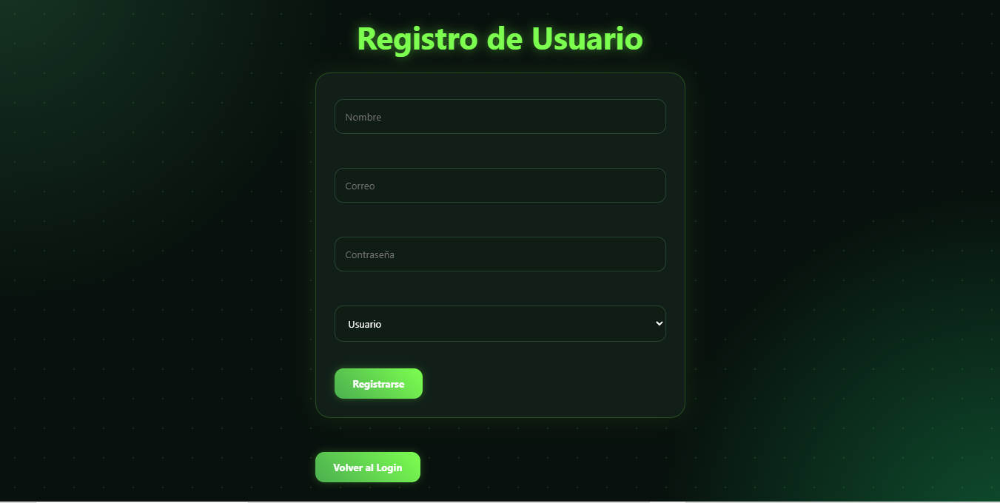
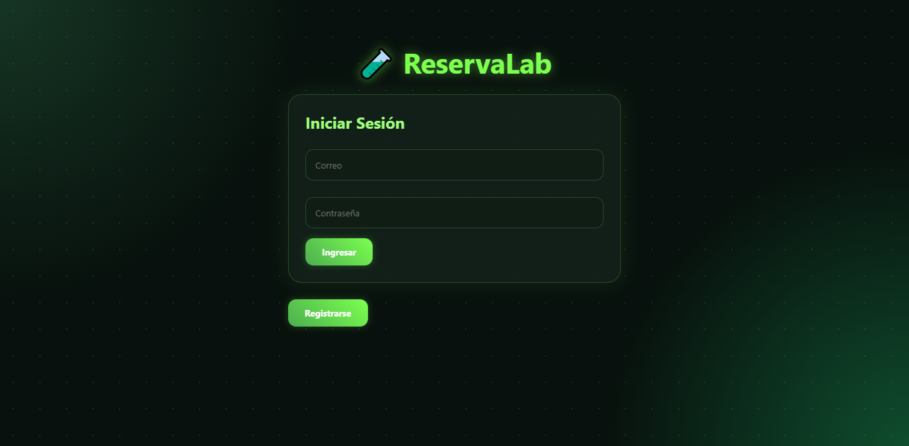
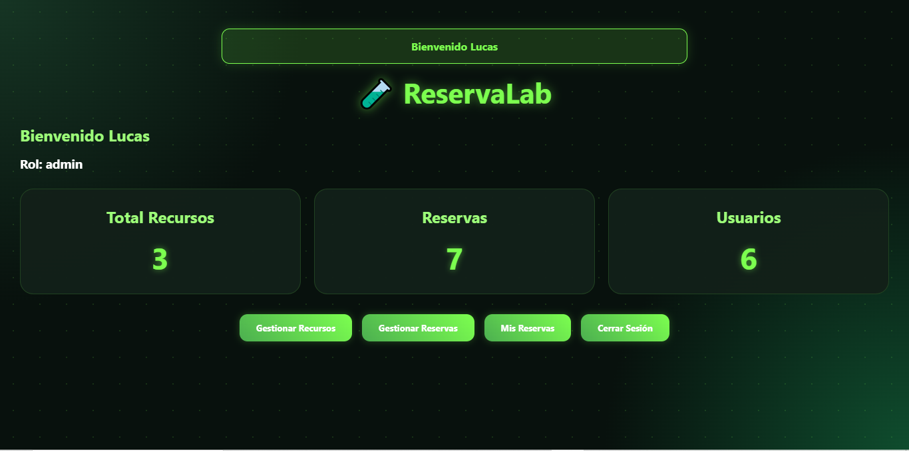
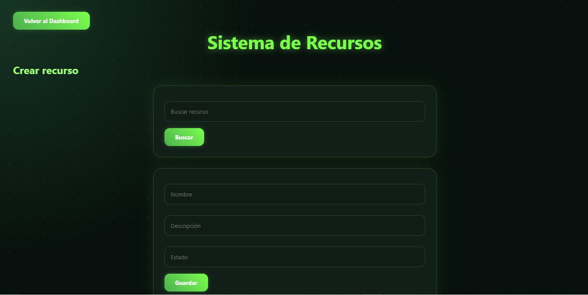
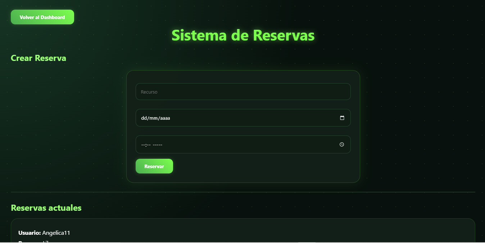
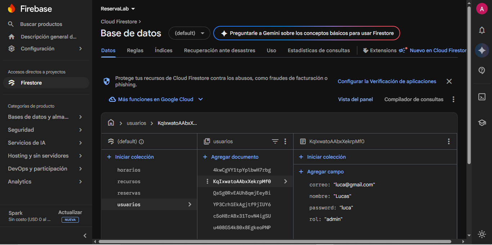

# ReservaLab

## Descripción del Proyecto

ReservaLab es una aplicación web desarrollada para gestionar la reserva de recursos como laboratorios, salas de estudio, equipos o espacios de trabajo.

El sistema permite a los usuarios registrarse, iniciar sesión y realizar reservas indicando fecha y hora. Además, implementa operaciones CRUD (Crear, Consultar, Actualizar y Eliminar) sobre una base de datos en línea utilizando Firebase Firestore.

La aplicación cuenta con roles de usuario para controlar el acceso a las funcionalidades del sistema.

---

## Tecnologías Utilizadas

* Python
* Flask
* HTML5
* CSS3
* Firebase Firestore
* Git
* GitHub
* Vercel

---

## Funcionalidades del Sistema

### Gestión de Recursos

* Crear recursos.
* Consultar recursos.
* Editar recursos.
* Eliminar recursos.
* Buscar recursos por nombre.

### Gestión de Reservas

* Crear reservas.
* Consultar reservas.
* Modificar reservas.
* Cancelar reservas.
* Validación de conflictos de horario.

### Gestión de Usuarios

* Registro de usuarios.
* Inicio de sesión.
* Cierre de sesión.
* Visualización de reservas personales.

### Dashboard

* Total de recursos registrados.
* Total de reservas registradas.
* Total de usuarios registrados.

---

## Roles del Sistema

### Administrador

El administrador tiene acceso completo al sistema.

Puede:

* Gestionar recursos.
* Crear recursos.
* Editar recursos.
* Eliminar recursos.
* Gestionar reservas.
* Consultar todas las reservas.
* Visualizar estadísticas del sistema.

### Usuario

El usuario tiene acceso limitado.

Puede:

* Realizar reservas.
* Consultar sus reservas.
* Modificar reservas.
* Cancelar reservas.

No puede:

* Crear recursos.
* Editar recursos.
* Eliminar recursos.

Esta restricción permite mantener la seguridad y evitar modificaciones no autorizadas en la información principal del sistema.

---

## Base de Datos

La aplicación utiliza Firebase Firestore con las siguientes colecciones:

### usuarios

| Campo    | Tipo   |
| -------- | ------ |
| nombre   | String |
| correo   | String |
| password | String |
| rol      | String |

### recursos

| Campo       | Tipo   |
| ----------- | ------ |
| nombre      | String |
| descripcion | String |
| estado      | String |

### reservas

| Campo   | Tipo   |
| ------- | ------ |
| usuario | String |
| recurso | String |
| fecha   | String |
| hora    | String |
| estado  | String |

### horarios

| Campo       | Tipo    |
| ----------- | ------- |
| recurso     | String  |
| fecha       | String  |
| hora_inicio | String  |
| hora_fin    | String  |
| disponible  | Boolean |

---

## Instrucciones de Instalación

### 1. Clonar el repositorio

```bash
git clone URL_DEL_REPOSITORIO
```

### 2. Ingresar al proyecto

```bash
cd ReservaLab
```

### 3. Crear entorno virtual

```bash
python -m venv venv
```

### 4. Activar entorno virtual

```bash
venv\Scripts\activate
```

### 5. Instalar dependencias

```bash
pip install flask
pip install firebase-admin
```

### 6. Ejecutar la aplicación

```bash
python app.py
```

### 7. Abrir en el navegador

```text
http://127.0.0.1:5000
```

---

## URL del Despliegue

**Aplicación desplegada:**

```text
PEGAR_AQUI_URL_DE_VERCEL
```

---

## Capturas del Sistema

### Registro de usuarios



### Inicio de sesión



### Dashboard



### Gestión de recursos



### Gestión de reservas



### Base de datos Firebase



---

## Autor

**Angelica Garcia**

Proyecto desarrollado como evidencia de aprendizaje para la implementación de una aplicación web CRUD con base de datos en la nube utilizando Python, Flask y Firebase Firestore.
